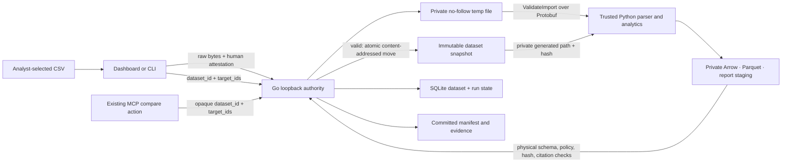

# ADR 0002: AGENTintel Agent-First Local Competitive Pulse Import Alpha

- Status: Proposed; accepted when the ZIL-155 pull request is merged
- Date: 2026-07-16
- Decision owner: Reed Richards (architecture and contracts)
- Product owner: Thomas Anderson
- Implementation owners: Wade Load, Barbara Gordon, and Futaba Sakura
- Review owners: Elliot Alderson, Sheldon Cooper, and Motoko Kusanagi

## Context

AGENTintel is the confirmed target product identity: an independent,
local-first, evidence-first agent tool. The inherited repository still presents
AGENTintel/GolemWorkers throughout code, contracts, persisted identifiers, and
legal files, and remains Elastic-2.0 source-available rather than an
OSI-approved open-source distribution. This ADR neither performs that migration
nor makes an open-source release claim.

The implemented Phase 1 comparison is deliberately synthetic. The next private
alpha must let a competitive-intelligence or brand-strategy analyst import one
small, permitted public dataset, hand an opaque reference to their agent, and
receive bounded cited findings without turning the daemon or agent into a file
browser, scraper, research planner, or unrestricted data processor.

The repository already has boundaries worth preserving:

- the Go daemon is authoritative for policy, durable state, immutable input,
  cancellation, evidence validation, and publication;
- the Python worker owns normalization and deterministic analytics;
- `golem.observations.v1` is an exact 32-field Arrow/Parquet contract;
- metric definitions prohibit missing-as-zero and silent denominator changes;
- every published artifact and citation is physically revalidated by Go; and
- the six MCP actions expose workflows rather than credentials or files.

The alpha is one local comparison workflow. It does not add broad research,
source discovery, an LLM, live collection, browser automation, schedules,
alerts, contacts, people intelligence, outreach, or external model calls.

### Inputs from the independence audits

This decision incorporates the visible results of ZIL-162 and ZIL-163:

- clean Go, Python, and TypeScript component gates are reproducible, but the
  root `pnpm check` is not currently a public clean-checkout gate because it
  requires the gitignored private reference laboratory;
- Rust verification depends on a correctly activated stable toolchain, and the
  Protobuf breaking check needs a maintainer-supplied released baseline;
- legacy identity is embedded in about 130 files, including schema IDs,
  Protobuf packages, cookies/headers, data directories, keyring/vault values,
  MCP tools, package names, desktop metadata, updater URLs, and legal notices;
- renaming those values is a compatibility migration, not a global text
  replacement; and
- the final OSI-approved license, copyright/licensor, package namespaces,
  reverse-DNS identity, and hard-break versus alias policy remain owner/legal
  decisions under ZIL-153 and the later migration ADR ZIL-175.

ZIL-162's visible summary is sufficient to constrain this feature ADR, but its
detailed evidence was linked only through a machine-local path and remains a
release-readiness documentation gap. This ADR therefore makes no clean-checkout,
CI, packaging, licensing, or public-release completion claim.

### Identity and namespace boundary

The user-facing name in this specification is AGENTintel. Existing `golem.*`,
`agentintel_*`, `agentintel`, `X-AgentIntel-*`, and `agentintel.v1` values are
treated strictly as inherited compatibility identifiers. ZIL-155 does not
rename or relicense them.

For the smallest implementation on the current pre-migration baseline, the new
CSV, preview, and report wire IDs below use the inherited `golem.*` namespace.
That is a compatibility choice, not brand endorsement or a decision that the
final AGENTintel namespace should retain it. ZIL-175 must classify these new IDs
with the rest of the contract surface and either retain them as documented
legacy aliases, dual-read them during a bounded migration, or include them in an
explicit alpha hard break. Import implementers must not independently rename
them or edit `LICENSE`, `NOTICE`, package/module IDs, MCP tool names, durable
paths, cookies, headers, or desktop identity.

## Decision summary

The alpha accepts exactly one versioned UTF-8 CSV contract,
`golem.competitive-pulse-import.v1`. A human-controlled dashboard or CLI sends
the file bytes to the authenticated exact-loopback daemon. The request never
contains a path for the daemon to open.

The daemon streams the bytes into a private temporary file while enforcing the
transport limit and calculating SHA-256. The trusted Python parser validates
the same temporary bytes used by analysis. A valid preview is atomically moved
into the private content-addressed input store and receives a random opaque
`dataset_id`; invalid bytes are deleted and never become a dataset or run.

A comparison references the `dataset_id` and 2–5 target IDs. The existing MCP
comparison action may accept that opaque reference, but MCP cannot upload,
enumerate, or delete local files or datasets. Before a run is queued, the
daemon binds the run transactionally to the already-immutable snapshot. Replay
uses only that snapshot and the pinned v1 contracts.

The canonical 32-field observation schema is unchanged. Import-specific
missingness and metric-to-evidence resolution require a new
`golem.comparison-report.v2`; the existing synthetic fixture continues to emit
`golem.comparison-report.v1`.

The following are invariants, not implementation suggestions:

1. No public request field is interpreted as a daemon-side filesystem path.
2. A run cannot exist before a successful byte-for-byte preview snapshot.
3. The raw snapshot hash is recorded on the dataset, run, and every canonical
   observation derived from it.
4. Imported source URLs are inert citation strings. Validation and analysis do
   not resolve, fetch, redirect through, or preflight them.
5. Only `public` + `competitive_research` + `permitted` rows are accepted.
6. Missing, insufficient, and contradictory metrics have a null value and an
   explicit state; they are never zero-filled or silently adjudicated.
7. Every non-null report metric names the exact canonical observation IDs used
   to calculate it, and every named ID resolves to complete source provenance.
8. Cancelled or failed runs and manually deleted or retention-expired lineages
   expose no report.
9. Replay never reopens the analyst's original file and never silently upgrades
   the input, parser, or metric contract.
10. Import validation and analysis perform no non-loopback network request.

## Domain and trust boundaries



| Boundary           | Owns                                                                                                                        | Must not trust                                                                |
| ------------------ | --------------------------------------------------------------------------------------------------------------------------- | ----------------------------------------------------------------------------- |
| Dashboard/CLI      | Human file selection and explicit source-policy confirmation                                                                | Browser MIME, filename, client validation, or original path                   |
| Go authority       | Authentication/CSRF, body bounds, hashing, snapshot, dataset/run state, retention, canonical artifact and report validation | Client path/name, worker-declared counts/hashes, or report claims             |
| Python worker      | One CSV parser, canonical normalization, deterministic metrics, sanitized diagnostics                                       | CSV cells, source URLs, file order, or authority outside the supplied request |
| Committed evidence | Immutable Arrow, Parquet, report, and manifest allowlist                                                                    | Staging files or undeclared files                                             |
| MCP                | Existing high-level run actions and opaque references created by a human                                                    | File bytes, filesystem paths, source authorization, or policy mutation        |

The packaged and developer Python workers remain trusted same-user product
code, not an operating-system sandbox. The import path contains no networking
code and must pass an egress-observation acceptance test. A future public
release still needs a separately approved OS-level egress boundary; output
validation alone does not protect the host from malicious worker code.

## Complete user journey

### Primary agent-first journey

1. In a human-controlled dashboard or CLI, the analyst selects the CSV,
   confirms the brand/public/permitted purpose attestation, and receives a valid
   immutable `dataset_id` plus discovered target IDs.
2. The control surface produces a copyable handoff containing only
   `dataset_id`, 2–5 selected `target_ids`, and an optional bounded display goal.
   It contains no path, bytes, token, source URL list, or new authority.
3. The analyst gives that handoff to their MCP/Codex-compatible agent. The agent
   calls the existing `agentintel_compare_start`; the daemon rechecks every
   policy and dataset invariant and returns a durable run ID.
4. The agent uses the existing `agentintel_run_get` to follow ordered state and
   retrieve the cited v2 report. It cannot expand targets, upload another file,
   add sources, invoke research planning, or fetch citations.
5. Cancellation, replay, and destructive dataset deletion remain deliberate
   human controls in the dashboard/CLI/API. The agent may report their
   availability but receives no new destructive action.

The dashboard and CLI are import approval, control, recovery, and evidence
inspection companions. Direct human start remains a supported fallback and test
path, but the primary product contract is the opaque-reference agent flow.

### Dashboard

1. The analyst chooses one `.csv` file. The browser may show its basename, but
   sends neither that name nor an absolute path to the daemon.
2. The analyst confirms the versioned public/permitted competitive-research
   attestation. The dashboard sends the raw bytes for preview.
3. Preview shows validity, SHA-256 prefix, byte/row counts, platform, retention
   deadline, diagnostics, discovered targets, and per-target metric
   availability. No run has been created.
4. The analyst selects 2–5 discovered targets. Handoff/direct start remains
   disabled unless at least one metric is comparable across the complete
   selection.
5. The primary action copies the bounded agent handoff. A secondary direct-start
   action creates the same durable `compare` run for human fallback and
   acceptance testing. Either path binds the run to the dataset snapshot, and
   the existing event stream shows queue, normalization, analysis, commit, and
   one terminal state.
6. The analyst can cancel a queued or running run. A cancelled run has no
   committed report.
7. A successful report distinguishes available, missing, insufficient, and
   contradictory metrics and opens an evidence panel from each metric.
8. Replay creates a new run with the same dataset, target selection, input hash,
   parser contract, and metric catalog. It does not require the original file.

Refreshing before a valid preview is committed requires reselecting the local
file. After a dataset or run exists, only its opaque ID may be restored; no file
bytes, path, bootstrap token, or service token is stored in browser storage.

### CLI

The frozen command journey is:

```text
agentintel import preview --file ./competitive-pulse.csv --confirm-permitted-public-brand
agentintel compare --dataset DATASET_ID --project local --target TARGET --target TARGET [--wait]
agentintel cancel RUN_ID [--reason TEXT]
agentintel report RUN_ID
agentintel replay RUN_ID
agentintel dataset delete DATASET_ID --yes
```

The CLI opens `--file` itself as a regular non-symlink file, streams its bytes,
and does not serialize the argument or resolved path. `import preview` prints
the same sanitized preview contract as the dashboard. `agentintel` is the
current inherited binary name; this ADR does not choose its AGENTintel migration
or alias.

### MCP and Codex

`agentintel_compare_start` gains an optional `dataset_id`. When it is present:

- `connector_ids` and simulations are forbidden;
- `target_ids` is limited to 2–5 IDs present in that dataset;
- the daemon rechecks dataset state, purpose, rights, retention, and metric
  comparability; and
- the operation remains non-idempotent and returns a new run ID.

The tool count remains six. There is no agent upload, path, file-read, dataset
listing, dataset deletion, policy mutation, or general import tool. A human must
create and deliberately provide the opaque dataset reference first. The current
`agentintel_*` tool names remain compatibility identifiers pending ZIL-175; the
user-facing product and handoff language says AGENTintel.

## CSV v1 media and grammar

| Property                       | Frozen value                                                     |
| ------------------------------ | ---------------------------------------------------------------- |
| Schema ID                      | `golem.competitive-pulse-import.v1`                              |
| Media type                     | `text/csv; charset=utf-8`                                        |
| Encoding                       | UTF-8 without BOM; invalid sequences are rejected                |
| Maximum raw body               | 8,388,608 bytes                                                  |
| Maximum data records           | 10,000, excluding the header                                     |
| Maximum encoded record         | 65,536 bytes                                                     |
| Maximum general decoded field  | 4,096 Unicode scalar values; lower per-column limits still apply |
| Delimiter / quote              | comma / double quote; a quote is escaped as `""`                 |
| Record ending                  | LF or CRLF; one optional final record ending                     |
| Compression / content encoding | none / identity only                                             |

The parser implements the quoting rules needed for comma and quote characters,
but v1 rejects CR or LF inside a quoted field. Comments, blank records,
duplicate headers, extension columns, alternate delimiters, locale-specific
numbers, formulas, macros, and encoding detection are not supported. Empty and
quoted-empty cells both mean null. Whitespace is data and is never trimmed.

All 22 columns are mandatory and must appear once in exactly this order. V1 has
no optional or vendor-extension columns; conditional cells are described below.

```text
schema_version,observation_id,target_id,target_name,platform,metric,value,numerator,denominator,content_id,content_format,published_at,observed_at,recorded_at,source_url,native_id,confidence,coverage,data_class,permitted_purpose,retention_days,rights_state
```

Free-text cells must be Unicode NFC, contain no C0/C1 control character or
surrounding whitespace, and must not start with `=`, `+`, `-`, or `@`. Values
are never evaluated as spreadsheet formulas. Error messages contain coordinates
and rule names, never the rejected cell value.

## CSV columns

| Column              | Required value and validation                                                                                                                                                                       |
| ------------------- | --------------------------------------------------------------------------------------------------------------------------------------------------------------------------------------------------- |
| `schema_version`    | Exact constant `golem.competitive-pulse-import.v1`.                                                                                                                                                 |
| `observation_id`    | 1–128 ASCII characters matching `^[A-Za-z0-9][A-Za-z0-9._:-]{0,127}$`; unique in the file.                                                                                                          |
| `target_id`         | 1–64 lowercase ASCII characters matching `^[a-z0-9](?:[a-z0-9-]{0,62}[a-z0-9])?$`. The file contains 2–5 distinct brand/organization IDs; natural-person targets are out of scope.                  |
| `target_name`       | 1–200 Unicode scalar values; one exact NFC brand/organization name per `target_id`. No entity resolution or name-based merge occurs.                                                                |
| `platform`          | 1–64 lowercase ASCII characters matching `^[a-z0-9][a-z0-9._-]{0,63}$`; exactly one platform across the file.                                                                                       |
| `metric`            | One of `followers`, `content_published`, or `engagement_rate`.                                                                                                                                      |
| `value`             | Metric-specific. Followers use an integer from 0 through 9,007,199,254,740,991; content uses exactly `1`; engagement leaves it empty and the rate is calculated from its two counts.                |
| `numerator`         | Empty except for engagement; engagement requires an integer from 0 through 9,007,199,254,740,991 representing public likes plus public comments.                                                    |
| `denominator`       | Empty except for engagement; engagement requires an integer from 1 through 9,007,199,254,740,991 representing the paired public follower count.                                                     |
| `content_id`        | Empty for followers; otherwise 1–256 characters matching the observation-ID alphabet. Exactly one content row and at most one engagement row exist per `(target_id, content_id)`.                   |
| `content_format`    | Empty for followers; otherwise one of `video`, `short`, `image`, `carousel`, `text`, `live`, `audio`, or `unknown`. It must agree for a content/engagement pair.                                    |
| `published_at`      | Empty for followers; otherwise a UTC timestamp and no later than `observed_at`. It must agree for a content/engagement pair.                                                                        |
| `observed_at`       | Required UTC timestamp: `YYYY-MM-DDTHH:MM:SS[.ffffff]Z`. Offsets, timezone-free values, and more than six fractional digits are rejected.                                                           |
| `recorded_at`       | Same timestamp grammar; must be at or after `observed_at` and no later than the authority validation time plus five minutes.                                                                        |
| `source_url`        | A 1–2,048 byte ASCII citation satisfying the complete `source-reference.v1` policy below. It is stored exactly, rendered as inert text, and never fetched or opened by the product.                 |
| `native_id`         | 1–256 NFC characters identifying the source record. It need not be globally unique.                                                                                                                 |
| `confidence`        | Required plain decimal in `[0,1]` with at most six fractional digits. It is the importer's stated source/extraction confidence, not a probability that a business claim is true. No default exists. |
| `coverage`          | Required plain decimal in `(0,1]` with at most six fractional digits. It is the stated coverage of this observation. No default exists.                                                             |
| `data_class`        | Exact constant `public`.                                                                                                                                                                            |
| `permitted_purpose` | Exact constant `competitive_research`.                                                                                                                                                              |
| `retention_days`    | Integer 1–365, identical on every row. The authority derives one absolute deadline from the successful validation time.                                                                             |
| `rights_state`      | Exact constant `permitted`. This is a recorded user attestation, not independent proof of source terms.                                                                                             |

Numeric cells use ASCII digits and an optional decimal point only. Exponents,
signs, thousands separators, `NaN`, infinity, booleans, `NULL`, `N/A`, and
locale-specific forms are rejected.

### Source-reference policy

`source-reference.v1` is the single acceptance, authority-revalidation, and UI
policy. Python applies it during preview. Go applies the same ordered rules to
every canonical/report citation before authority commit and also requires the
emitted string to equal the accepted canonical row byte-for-byte. The dashboard
does not implement a third URL validator: it renders that validated string as
escaped text under the fixed non-navigation rule.

A source URL is valid only when all of these conditions hold:

1. The cell is 1–2,048 ASCII bytes, has no raw whitespace or backslash, and is
   syntactically exactly one URI. Every percent escape is two hexadecimal
   digits. Percent-decoding the path exactly once must produce valid UTF-8 with
   no U+0000–U+001F or U+007F–U+009F control, whitespace, or backslash.
2. The literal prefix is lowercase `https://`. Every other scheme, mixed-case
   spelling, scheme-relative reference, and relative reference is rejected.
3. The authority has no userinfo. Any username, password, or bare `@` before
   the first path separator is rejected.
4. The host is an ASCII IDNA DNS name with at least two non-empty labels, no
   trailing dot, and labels matching
   `^[A-Za-z0-9](?:[A-Za-z0-9-]{0,61}[A-Za-z0-9])?$`. IP literals of every
   class, IPv6 zone identifiers, `localhost`, and names ending in
   `.localhost`, `.local`, or `.home.arpa` are rejected. Reserved `.invalid`,
   `.test`, and `.example` names remain valid inert citations for sanitized
   fixtures.
5. An explicit port, query, or fragment is forbidden. V1 therefore accepts no
   URL userinfo, signed/query credential, tracking query, or fragment token and
   does not rely on a heuristic secret-key list.

The stored `source_url` is the exact accepted ASCII string. The conformance
fixture's derived `source_host` is the parsed host lowercased without
normalization of the path; it is a validator expectation, not a 33rd canonical
field or a value the dashboard must derive.

Each invalid cell emits exactly one source-URL diagnostic: the first matching
rule in this precedence order is
`source_url_invalid`, `source_url_control_character`, `source_url_scheme`,
`source_url_credentials`, `source_url_host_forbidden`,
`source_url_port_forbidden`, `source_url_query_forbidden`, then
`source_url_fragment_forbidden`. Generic free-text rules still run before this
policy, so a raw C0/C1 character is `field_control_character`; the source URL
code covers a percent-encoded control.

Every accepted source reference has `clickable: false` in this alpha. The
dashboard must not render an anchor, call a browser-open API, prefetch, resolve,
or probe it. It may offer an explicit copy action for the exact escaped string.
Consequently a DNS name that later resolves to loopback, private, or link-local
space is still never a product navigation target. No DNS lookup is performed to
classify it. A future clickable-citation feature requires a new policy version
and security review; `noopener,noreferrer` alone is not sufficient.

The normative cross-language cases are
[`source-url-policy.json`](../../fixtures/competitive-pulse-import-v1/source-url-policy.json).
Python, Go, SDK, and dashboard tests consume that file; no lane may add a local
acceptance or clickability exception.

### Metric-specific row invariants

| `metric`            | Derived definition and unit                       | Required/empty cells                                                                                      |
| ------------------- | ------------------------------------------------- | --------------------------------------------------------------------------------------------------------- |
| `followers`         | `followers.v1`, unit `followers`                  | `value` required; numerator, denominator, content ID/format, and published time empty                     |
| `content_published` | `content-observation.v1`, unit `content`          | value exactly 1; content ID/format and published time required; numerator and denominator empty           |
| `engagement_rate`   | `public-engagement-by-followers.v1`, unit `ratio` | value empty; non-negative numerator, positive denominator, content ID/format, and published time required |

For this connector version, the engagement numerator is fixed to public likes
plus public comments. If either component is unavailable, the engagement row is
absent; it is not set to zero. A future interaction scope requires a new CSV
schema/connector version and metric-definition version. The worker computes
`value = numerator / denominator` using float64. Because the CSV does not carry
a second rate value, it cannot silently disagree with its denominator.

Every engagement row must match exactly one content row on target, content ID,
format, and published time. This keeps posting-cadence and content-mix
populations independent of engagement availability.

## File-level and cross-record validation

- There are 2–5 distinct `target_id` values and one exact `platform`.
- Each target ID maps to one exact target name.
- Policy constants and `retention_days` are identical on every record.
- Observation IDs are unique.
- An exact observation fingerprint—target, metric, native ID, observed time,
  source URL, value/counts, and content fields—may appear only once, even under
  a different observation ID.
- A target/content pair has exactly one `content_published` record and no more
  than one `engagement_rate` record.
- Input order has no semantic meaning. Accepted records are normalized in the
  stable order `(target_id, observed_at, observation_id)`; out-of-order input is
  neither rejected nor rewritten in the raw snapshot.
- Differing follower values at the same target/timestamp from distinct source
  records are retained as contradictory evidence. Preview and reports apply the
  exact follower-state algorithm below; no row is deleted or selected by
  source order.
- A syntactically and semantically valid dataset may have missing metrics.
  Comparison start requires at least one output metric that is available for
  every selected target; otherwise it fails before creating a run.

The successful validation time is authority-supplied UTC. All canonical rows
receive `retention_until = validated_at + retention_days × 24h`. Start requires
at least 15 minutes of remaining retention so an accepted run cannot knowingly
cross its deadline during normal bounded execution.

## Deterministic diagnostics

Preview diagnostics use this shape:

```json
{
  "severity": "error",
  "code": "field_required",
  "record_number": 2,
  "column": "observed_at",
  "message": "A required observed_at value is missing."
}
```

`record_number` counts the header as record 1. It equals the physical line
number because embedded newlines are forbidden. File-level diagnostics use
`null` for record and column. Messages are fixed templates and do not interpolate
cell contents, local paths, URLs, target names, or IDs.

Transport and lexical errors stop parsing. After a valid header, semantic
validation returns at most 100 diagnostics, ordered by record number, header
column order, severity (`error` before `warning`), and code. The response sets
`diagnostics_truncated: true` when more exist. Any error means `valid: false`,
no `dataset_id`, and immediate private-temp cleanup. Warnings do not prevent a
dataset.

The two size limits have deliberately different owners and channels. Go alone
enforces the 8,388,608-byte transport cap and returns HTTP 413 Problem
`input_too_large`. Go does not count CSV records. After recognizing 10,000
complete data records, the worker treats the first byte that begins data record
10,001 as the terminal semantic condition. It returns HTTP 200 with
`valid: false`, `row_count: 10001`, `diagnostics_truncated: false`, and exactly
one `csv_record_limit_exceeded` error at physical `record_number: 10002` with
`column: null`; it does not inspect later records. The fixed message is
`The CSV contains more than 10000 data records.` No dataset is committed.

| Code                            | Severity / scope        | Trigger                                                                                  |
| ------------------------------- | ----------------------- | ---------------------------------------------------------------------------------------- |
| `import_attestation_required`   | HTTP error              | Required human attestation header is absent or not the exact v1 value.                   |
| `unsupported_media_type`        | HTTP error              | Content-Type is not exact CSV UTF-8.                                                     |
| `unsupported_content_encoding`  | HTTP error              | Body is compressed or otherwise encoded.                                                 |
| `input_empty`                   | HTTP error              | Zero body bytes.                                                                         |
| `input_too_large`               | HTTP error              | Raw bytes exceed 8,388,608; Go returns HTTP 413 before semantic preview.                 |
| `input_read_failed`             | HTTP error              | The daemon cannot finish the private streamed copy; no diagnostic echoes the cause path. |
| `invalid_utf8`                  | error / file            | Invalid UTF-8.                                                                           |
| `utf8_bom_forbidden`            | error / file            | A UTF-8 BOM is present.                                                                  |
| `csv_syntax`                    | error / record          | Invalid quoting, delimiter, or trailing characters.                                      |
| `csv_embedded_newline`          | error / record          | CR or LF occurs inside a quoted field.                                                   |
| `csv_empty_record`              | error / record          | A blank record occurs before EOF.                                                        |
| `csv_record_too_large`          | error / record          | Encoded record exceeds 65,536 bytes.                                                     |
| `csv_record_limit_exceeded`     | error / record          | Worker encounters data record 10,001; preview stops with the frozen result above.        |
| `csv_header_missing`            | error / file            | No complete header exists.                                                               |
| `csv_duplicate_header`          | error / header          | A header name repeats.                                                                   |
| `csv_missing_column`            | error / header          | A required v1 column is absent.                                                          |
| `csv_unknown_column`            | error / header          | A non-v1 column is present.                                                              |
| `csv_column_order`              | error / header          | The 22 names are not in the frozen order.                                                |
| `field_required`                | error / cell            | A conditionally required cell is empty.                                                  |
| `field_must_be_empty`           | error / cell            | A metric requires the cell to be null.                                                   |
| `field_whitespace`              | error / cell            | A value has surrounding whitespace.                                                      |
| `field_control_character`       | error / cell            | A decoded value contains a forbidden control.                                            |
| `field_formula_prefix`          | error / cell            | A free-text value begins with a spreadsheet formula prefix.                              |
| `field_too_large`               | error / cell            | A decoded value exceeds its column limit.                                                |
| `field_format`                  | error / cell            | An ID, numeric, or NFC grammar is invalid.                                               |
| `field_out_of_range`            | error / cell            | A numeric value is outside its documented interval.                                      |
| `field_enum`                    | error / cell            | A value is not in its documented closed set.                                             |
| `timestamp_format`              | error / cell            | Timestamp grammar or UTC requirement fails.                                              |
| `timestamp_order`               | error / row             | Published/observed/recorded ordering fails.                                              |
| `timestamp_in_future`           | error / row             | `recorded_at` exceeds validation time by more than five minutes.                         |
| `source_url_invalid`            | error / cell            | URL length, ASCII, URI, or percent-escape grammar is invalid.                            |
| `source_url_control_character`  | error / cell            | Percent-decoded path contains a control, whitespace, or backslash.                       |
| `source_url_scheme`             | error / cell            | Literal scheme prefix is not lowercase `https://`.                                       |
| `source_url_credentials`        | error / cell            | Authority contains userinfo or a bare authority `@`.                                     |
| `source_url_host_forbidden`     | error / cell            | Host is not the permitted multi-label DNS form or is a forbidden local/special host.     |
| `source_url_port_forbidden`     | error / cell            | Authority contains an explicit port.                                                     |
| `source_url_query_forbidden`    | error / cell            | URL contains a query, including an empty query.                                          |
| `source_url_fragment_forbidden` | error / cell            | URL contains a fragment, including an empty fragment.                                    |
| `schema_version_unsupported`    | error / cell            | Row schema ID is not the exact v1 constant.                                              |
| `metric_field_combination`      | error / row             | Metric-specific required/empty/value rules fail.                                         |
| `content_reference_missing`     | error / row             | Engagement has no matching content record.                                               |
| `content_reference_mismatch`    | error / row             | Engagement content format or published time disagrees with its content record.           |
| `policy_data_class_forbidden`   | error / cell            | Data class is not `public`.                                                              |
| `policy_purpose_forbidden`      | error / cell            | Purpose is not `competitive_research`.                                                   |
| `policy_rights_forbidden`       | error / cell            | Rights state is not `permitted`.                                                         |
| `policy_value_conflict`         | error / file            | File-scoped platform, policy, or retention value changes between rows.                   |
| `duplicate_observation_id`      | error / row             | Observation ID appeared earlier.                                                         |
| `duplicate_observation`         | error / row             | Exact observation fingerprint appeared earlier.                                          |
| `duplicate_content_metric`      | error / row             | A target/content pair repeats a content or engagement metric.                            |
| `target_count_out_of_range`     | error / file            | Distinct target count is outside 2–5.                                                    |
| `target_name_conflict`          | error / row             | One target ID maps to multiple names.                                                    |
| `platform_count_out_of_range`   | error / file            | More or fewer than one platform exists.                                                  |
| `observation_value_conflict`    | warning / records       | Distinct follower source records disagree at one target/timestamp. Rows are retained.    |
| `metric_missing`                | warning / target metric | No evidence exists for an output metric.                                                 |
| `metric_insufficient`           | warning / target metric | Evidence exists but does not meet the metric's minimum population.                       |
| `metric_contradictory`          | warning / target metric | A follower conflict exists and fewer than two unambiguous timestamps remain.             |
| `short_cadence_window`          | warning / target metric | Observation span is under seven days and the fixed seven-day denominator is used.        |
| `partial_metric_coverage`       | warning / target metric | Contradictory or ineligible rows reduce the declared population.                         |

API state errors (`dataset_not_found`, `dataset_expired`, `dataset_deleting`,
`dataset_deleted`, `dataset_retention_too_short`, `target_selection_invalid`,
`target_not_in_dataset`, `no_comparable_metric`, `input_snapshot_corrupt`, and
`replay_version_unavailable`) use the existing RFC 9457-style Problem response
and are not CSV diagnostics.

| Problem code                  | HTTP | Trigger                                                                            |
| ----------------------------- | ---: | ---------------------------------------------------------------------------------- |
| `dataset_not_found`           |  404 | The authenticated local store has no matching dataset tombstone or live row.       |
| `dataset_expired`             |  410 | Deadline has passed, or deletion is gated/deleted with reason `retention_expired`. |
| `dataset_deleting`            |  409 | Manual deletion gate committed and cleanup is in progress.                         |
| `dataset_deleted`             |  410 | Manual deletion completed and only a content-free tombstone remains.               |
| `dataset_retention_too_short` |  409 | Fewer than 15 minutes remain before expiry.                                        |
| `target_selection_invalid`    |  422 | Selection is not 2–5 unique, grammar-valid IDs.                                    |
| `target_not_in_dataset`       |  422 | At least one selected target is absent; detail does not echo the ID.               |
| `no_comparable_metric`        |  422 | No output metric is available for every selected target.                           |
| `input_snapshot_corrupt`      |  500 | Authority hash/size verification of its private snapshot fails.                    |
| `replay_version_unavailable`  |  409 | The exact recorded CSV parser or metric catalog cannot run.                        |

## Exact canonical observation mapping

The importer emits the existing fields in the existing order and types. It may
not add a 33rd field, make a non-nullable field nullable, relax a governance
validator, or publish CSV directly as evidence.

| Canonical `golem.observations.v1` field | Import v1 source or derivation                                                                                   |
| --------------------------------------- | ---------------------------------------------------------------------------------------------------------------- |
| `observation_id`                        | CSV `observation_id`                                                                                             |
| `entity_id`                             | CSV `target_id`                                                                                                  |
| `entity_name`                           | CSV `target_name`                                                                                                |
| `platform`                              | CSV `platform`                                                                                                   |
| `content_id`                            | CSV `content_id`, or null for followers                                                                          |
| `dimension`                             | CSV `content_format`, or null for followers                                                                      |
| `metric`                                | CSV `metric`                                                                                                     |
| `metric_definition_version`             | Closed mapping in the metric-specific table                                                                      |
| `numerator`                             | CSV `numerator`, or null                                                                                         |
| `denominator`                           | CSV `denominator`, or null                                                                                       |
| `value`                                 | CSV follower/content value, or exact engagement numerator divided by denominator                                 |
| `unit`                                  | Closed mapping in the metric-specific table                                                                      |
| `published_at`                          | CSV `published_at`, or null for followers                                                                        |
| `observed_at`                           | CSV `observed_at`, normalized to UTC microseconds without changing the represented instant                       |
| `recorded_at`                           | CSV `recorded_at`, normalized to UTC microseconds                                                                |
| `valid_from`                            | CSV `observed_at`                                                                                                |
| `valid_to`                              | null; import v1 does not assert an end of validity                                                               |
| `source_url`                            | CSV `source_url`                                                                                                 |
| `native_id`                             | CSV `native_id`                                                                                                  |
| `connector_version`                     | Constant `local.competitive-pulse-import@1.0.0`                                                                  |
| `classification`                        | `observed` for follower/content rows; `derived` for the engagement rate calculated from imported observed counts |
| `confidence`                            | CSV `confidence`; never defaulted                                                                                |
| `artifact_hash`                         | Lowercase SHA-256 of the exact raw CSV snapshot                                                                  |
| `extraction_pointer`                    | `csv:record:<record_number>`                                                                                     |
| `freshness_seconds`                     | Floor of the non-negative duration from `observed_at` to `recorded_at`, in whole seconds                         |
| `availability`                          | Constant `available`; missing evidence is an absent row                                                          |
| `coverage`                              | CSV `coverage`; never defaulted                                                                                  |
| `acquisition_mode`                      | Constant `user_import`                                                                                           |
| `data_class`                            | Validated CSV constant `public`                                                                                  |
| `permitted_purpose`                     | Validated CSV constant `competitive_research`                                                                    |
| `retention_until`                       | Authority validation time plus the validated file-wide `retention_days`                                          |
| `rights_state`                          | Validated CSV constant `permitted`                                                                               |

Arrow and Parquet remain independently decoded and compared by Go. The authority
also requires every canonical `artifact_hash` to equal the run's recorded input
hash, every extraction pointer to address an existing CSV data record, every
row to remain within retention at commit, and every report citation to match a
canonical row exactly.

## Preview and dataset API contract

### Create a validated dataset

`POST /v1/datasets/competitive-pulse/preview`

- Authentication, exact-loopback Host/Origin, and dashboard CSRF rules are the
  same as other mutating endpoints.
- Parsed `Content-Type` is `text/csv` with required `charset=utf-8` and no
  other parameter.
- `Content-Encoding` is absent or `identity`.
- `X-AgentIntel-Import-Attestation` is exactly
  `public-permitted-brand-competitive-research.v1` and records that the targets
  are brands/organizations rather than natural people.
- The body is the CSV bytes. Neither filename nor path is accepted.
- `Cache-Control: no-store` applies to request handling and every response.

The daemon rejects an oversized declared `Content-Length` before reading and
also counts streamed bytes, so chunked transfer cannot bypass the cap. It opens
a random file beneath a mode-0700 private spool using create-exclusive and
no-follow behavior, writes mode 0600, hashes while writing, fsyncs, and passes
only that generated private path and expected hash to the trusted worker.
After the worker returns, Go reopens with no-follow semantics and rechecks the
exact size and hash before the atomic move, so worker-side mutation cannot turn
previewed bytes into a different dataset.

The endpoint returns HTTP 200 for a completed semantic preview, whether valid
or invalid. A valid result contains a dataset ID and is already durable. An
invalid result contains no dataset ID and its temporary bytes have already been
removed. Transport, authentication, or service failures use Problem responses
with their conventional HTTP status (400/401/403/413/415/500).

The response is `golem.import-preview.v1`:

```text
schema_version             constant
valid                      boolean
dataset_id                 string only when valid
state                      ready only when valid
validated_at               authority UTC time
retention_until            derived UTC time only when valid
input                      schema_id, sha256, size_bytes, row_count
policy                     attestation_version, target_scope, data_class,
                           purpose, retention_days, rights_state when determinable
platform                   exact platform when valid
targets[]                  ID, name, row count, four metric-availability states
diagnostics[]              ordered sanitized diagnostics
diagnostics_truncated      boolean
```

The committed golden response is
[`expected-preview.json`](../../fixtures/competitive-pulse-import-v1/expected-preview.json).

### Read or delete a dataset

`GET /v1/datasets/{datasetId}` returns the same sanitized summary plus current
state and never returns the raw bytes, private path, or full source URLs.

`DELETE /v1/datasets/{datasetId}` is human-only API/CLI functionality and
returns HTTP 202 with the affected dataset and run IDs. It transitions the
dataset through the atomic deletion gate below and cascades to every run derived
from that dataset, including replays. It is idempotent for an already
deleting/deleted dataset. MCP does not project either endpoint.

Every successful upload creates a new dataset ID, even when its content hash
matches another dataset. The private blob may be content-deduplicated, but
dataset policy, retention, deletion, and audit state remain independent. A blob
is removed only after no non-deleted dataset references it.

## Comparison start contract

`POST /v1/comparisons` remains the single comparison start endpoint. Its request
becomes a discriminated union:

- existing fixture branch: current `connector_ids`, 2–50 targets, and optional
  failure simulation, with no `dataset_id`;
- local-import branch: required `dataset_id`, 2–5 targets, no connector IDs, and
  no simulation.

The optional `goal` remains bounded display metadata. For an import it does not
trigger planning, change the dataset, authorize collection, alter the metric
population, or enter an external model prompt.

In one SQLite transaction, start verifies that the dataset is `ready`, has at
least 15 minutes of retention remaining, contains every unique requested
target, and has at least one metric available across the whole selection. It
then inserts the queued run with dataset ID, exact target selection, input
snapshot path/hash/schema/size, validated time, retention deadline, input parser
version, and metric catalog version. Only after commit does the manager signal
the worker loop.

No run row is created for a rejected selection. Repeating a successful start is
intentionally non-idempotent and creates another run. Replay is the explicit
operation for re-deriving an existing selection.

## Worker protocol and parser ownership

The Python worker owns one parser used for preview and analysis. Go does not
implement a second semantic CSV parser, and the browser does not determine
validity.

The additive Protobuf schema is frozen below. This ADR change is the normative
contract only; it does not change `worker.proto`, generated bindings, or runtime
dispatch.

| Parent                         | Field                      | Protobuf type            | Tag |
| ------------------------------ | -------------------------- | ------------------------ | --: |
| `WorkerEnvelope.oneof message` | `validate_import`          | `ValidateImport`         |  14 |
| `WorkerEnvelope.oneof message` | `import_validation_result` | `ImportValidationResult` |  15 |
| `StartAnalysis`                | `import_context`           | `ImportContext`          |  13 |

The complete new message and enum definitions are:

```proto
message ValidateImport {
  string request_id = 1;
  string input_path = 2;
  string input_sha256 = 3;
  string input_schema_id = 4;
  string validated_at = 5;
}

message ImportValidationResult {
  string request_id = 1;
  bool valid = 2;
  ImportInputSummary input = 3;
  ImportFilePolicySummary file_policy = 4;
  optional string platform = 5;
  repeated ImportTargetSummary targets = 6;
  repeated ImportDiagnostic diagnostics = 7;
  bool diagnostics_truncated = 8;
}

message ImportInputSummary {
  string schema_id = 1;
  string sha256 = 2;
  uint64 size_bytes = 3;
  optional uint64 row_count = 4;
}

message ImportFilePolicySummary {
  optional string target_scope = 1;
  optional string data_class = 2;
  optional string permitted_purpose = 3;
  optional uint32 retention_days = 4;
  optional string rights_state = 5;
}

message ImportTargetSummary {
  string target_id = 1;
  string target_name = 2;
  uint64 row_count = 3;
  map<string, ImportMetricAvailability> metric_availability = 4;
}

enum ImportMetricAvailability {
  IMPORT_METRIC_AVAILABILITY_UNSPECIFIED = 0;
  IMPORT_METRIC_AVAILABILITY_MISSING = 1;
  IMPORT_METRIC_AVAILABILITY_INSUFFICIENT = 2;
  IMPORT_METRIC_AVAILABILITY_CONTRADICTORY = 3;
  IMPORT_METRIC_AVAILABILITY_AVAILABLE = 4;
}

message ImportDiagnostic {
  ImportDiagnosticSeverity severity = 1;
  string code = 2;
  optional uint32 record_number = 3;
  optional string column = 4;
  string message = 5;
}

enum ImportDiagnosticSeverity {
  IMPORT_DIAGNOSTIC_SEVERITY_UNSPECIFIED = 0;
  IMPORT_DIAGNOSTIC_SEVERITY_ERROR = 1;
  IMPORT_DIAGNOSTIC_SEVERITY_WARNING = 2;
}

message ImportContext {
  string dataset_id = 1;
  string validated_at = 2;
  string input_parser_version = 3;
  string metric_catalog_version = 4;
}
```

`validated_at` in both messages is the same authority-supplied instant encoded
as canonical ASCII UTC RFC 3339 at whole-second precision:
`YYYY-MM-DDTHH:MM:SSZ`. Offsets, fractional seconds, leap-second spelling, and
an empty value are invalid. This encoding decision applies only to these new
fields; it does not reinterpret existing worker timestamp strings or the CSV
timestamp grammar.

`ImportInputSummary.row_count` is absent when parsing cannot determine a count;
zero means a successfully counted header-only file, which is still invalid under
the file rules. `ValidateImport.input_path` is only the generated private path
described above, `input_sha256` is exactly 64 lowercase hexadecimal characters,
and `input_schema_id` is the exact CSV schema ID. `ImportFilePolicySummary`
fields are present only when the worker can determine one coherent file-level
value. The worker does not receive or echo the human attestation: Go adds the
Go-owned `attestation_version` to the API preview after correlating and
validating this result. `platform` is present only when one coherent platform is
determined. For `valid: true`, `input`, `file_policy`, and `platform` are
present, all required nested fields are populated, and `targets` contains 2–5
entries ordered by ascending bytewise `target_id`.

Each target's `metric_availability` map contains exactly these four keys and no
others: `followers.delta`, `public-engagement-by-followers.median`,
`posting-cadence`, and `content-format-mix`. Every value is one of the four
nonzero enum states above; `UNSPECIFIED`, a missing key, and an extra key are
protocol errors. The Go API projects the enum values to the existing lowercase
strings `missing`, `insufficient`, `contradictory`, and `available`. Protobuf map
ordering has no meaning. The enum-valued map rejects unbounded string states
while preserving the versioned metric IDs; optional scalar presence prevents an
unknown count or policy value from becoming a fabricated zero or empty value.

An absent diagnostic `record_number` or `column` becomes JSON `null`; a present
record number is the physical record number defined above, and a present column
is the exact CSV header. `UNSPECIFIED` severity is invalid. Diagnostics retain
the existing 100-item bound, ordering, fixed-message, and sanitization rules. Go
projects `ERROR` and `WARNING` to the lowercase API strings `error` and
`warning`.

Compatibility and reservation rules are:

- Existing `WorkerEnvelope` tags 10–13 and `StartAnalysis` tags 1–12 are
  unchanged. The new tag assignments above are additive, and
  `protocol_version` remains `1`.
- Existing fixture compare/research requests omit `import_context`. Imported
  analysis requires it. Neither new envelope arm may be sent until both Go and
  Python use generated bindings containing this schema; an unknown arm must
  fail closed rather than fall back to analysis.
- Field types, field numbers, oneof numbers, enum names, and enum numeric values
  are permanent compatibility identifiers. A future removal must reserve both
  the deleted field name and number in its message (or the enum name and numeric
  value); neither may be reused. This addendum pre-reserves no speculative tag
  ranges. Future additions require unused numbers outside Protobuf's reserved
  19,000–19,999 range and a reviewed additive contract change.
- `request_id` is the sole preview correlation key. Import validation never
  uses `run_id`, and the result carries no `dataset_id`, `state`,
  `retention_until`, or API schema version; Go assigns those only after its
  authority checks and durable commit.

The expected versions are:

| Contract           | Version                                    |
| ------------------ | ------------------------------------------ |
| CSV schema         | `golem.competitive-pulse-import.v1`        |
| Input parser       | `golem-python-competitive-pulse-csv@1.0.0` |
| Connector          | `local.competitive-pulse-import@1.0.0`     |
| Metric catalog     | `competitive-pulse.v1`                     |
| Canonical evidence | `golem.observations.v1`                    |
| Report             | `golem.comparison-report.v2`               |

The preview result is a proposal. Go owns the body hash and size, dataset state,
attestation, retention clock, and target selection, and it revalidates the
worker's eventual Arrow, Parquet, report, provenance, rights, purpose,
retention, extraction pointers, and citations before publication.

### Mandatory protocol merge sequence

The current project stages cannot be executed literally because ZIL-158 consumes
messages owned by the later ZIL-159 lane. The protocol seam is therefore a
required, bounded pre-Stage-2 slice of ZIL-159:

1. This contract-only addendum receives independent exact-head review and
   merges without changing `worker.proto`, generated bindings, callers, or
   worker behavior.
2. Barbara then copies the field, type, tag, enum, presence, and timestamp
   decisions above verbatim into
   `contracts/proto/agentintel/v1/worker.proto` and runs
   `pnpm contracts:generate`. The only generated files allowed to change are
   `gen/go/agentintel/v1/worker.pb.go`,
   `gen/python/agentintel/v1/worker_pb2.py`, and
   `gen/typescript/agentintel/v1/worker_pb.ts`; they are mechanical output and
   are never hand-edited. That seam PR contains exactly the Proto source and
   those three generated bindings. `pnpm contracts:lint`, Buf lint,
   generation-diff, and existing protocol tests must pass. No caller or worker
   dispatch behavior is enabled in this seam.
3. The exact seam commit is merged. Only then may Wade start ZIL-158. Wade
   changes `workers/intelligence/**`, import fixture cases, and metric docs to
   implement Python dispatch, parsing, canonicalization, availability, and
   report v2 against the committed generated Python binding. Wade does not edit
   Proto or `gen/**`.
4. After Wade's worker protocol tests pass against that seam, Barbara resumes
   the rest of ZIL-159: Go preview invocation and authority validation,
   persistence, OpenAPI, SDK, CLI, and MCP. Barbara does not edit Python worker
   behavior.
5. Futaba starts only after the generated API/SDK contract from the completed
   ZIL-159 lane merges.

The parent coordinator must schedule the protocol-seam slice before promoting
the existing Stage-2 ZIL-158 issue; the numeric stage label does not override
this merge barrier. A change to a seam message after step 1 returns to Barbara
and blocks Wade rather than being patched concurrently in worker code.

## Dataset and run state machines

### Dataset state

```text
receiving (private temporary state)
  ├─ transport/validation error ─> removed (no durable row)
  └─ valid + fsync + atomic move ─> ready

ready ── manual delete gate ───────> deleting(reason=manual) ───────────> deleted
ready ── retention deadline gate ──> deleting(reason=retention_expired) ─> deleted
```

Only `ready`, `deleting`, and `deleted` are durable/public states. `expired` is
not a competing state: it is the externally visible condition derived from the
deadline and the durable `retention_expired` deletion reason. No comparison or
replay may start unless the dataset is `ready` and has at least 15 minutes
remaining.

Manual deletion and expiry use one linearizable deletion gate. In one SQLite
write transaction the daemon conditionally changes `ready` to `deleting`, sets
the immutable reason/request time, inserts or resumes one durable deletion job,
and changes every already-derived run's `data_state` to `deleting`. Start and
replay transactions read the same dataset row and require `ready`, so SQLite
serialization gives only two outcomes: a start commits first and its new run is
included by the gate, or the gate commits first and the start creates no run.
There is no interval in which a new start can escape an accepted delete/expiry.

Any API transaction that observes `now >= retention_until` first creates or
resumes the same `retention_expired` gate before returning
`dataset_expired`; it never exposes a stale `ready` dataset while waiting for
the periodic sweeper.

After the gate commits, the daemon cancels queued runs, requests cancellation
of running runs, and drains them to a durable terminal status. Authority commit
also requires dataset and run data state `ready` in its final transaction, so a
late worker result cannot publish after the gate. Only after every derived run
is terminal and no commit holds the transaction may cleanup remove content and
write the final content-free tombstones. Crash recovery resumes the durable
deletion job at its recorded phase and never moves a dataset back to `ready`.

### Run state

The public status enum remains unchanged:

```text
queued ─> running ─> succeeded
  │          ├─────> failed
  │          └─────> cancelled
  └────────────────> cancelled
```

Import v1 does not emit `partial`. Missing or contradictory evidence is a
successful report state when the report contract represents it honestly; an
operationally incomplete artifact set is a failure, not a partial success.

The import stages are `queued`, `starting`, `normalizing`, `analyzing`,
`commit`, and the terminal stage. Progress is monotonic. Cancellation is
accepted only while status is queued/running. The queue cancellation and final
evidence commit compete through durable state: exactly one terminal transition
wins. A cancelled or failed run has `report_available: false`, and any private
staging output is removed or recovered fail-closed.

Data lifecycle is orthogonal to terminal run status. Run headers gain
`dataset_id`, `source_kind`, `input_parser_version`, `metric_catalog_version`,
`data_state`, `data_retention_until`, `data_deleted_at`, and
`data_deletion_reason`. A succeeded run may later have `data_state: deleted`;
its report endpoint then returns 410 rather than resurrecting evidence.

## Replay contract

Replay is a new derivation, not a promise of byte-identical artifacts:

- it copies the original request snapshot and target selection;
- it references the same dataset ID and exact raw input hash;
- it uses the recorded CSV schema, input parser, and metric catalog versions;
- it reads the content-addressed snapshot, verifies hash/size, and never opens
  the original file;
- it produces a new run ID and `replay_of` link; and
- metric values, availability states, contradictions, evidence IDs, and claims
  must be deterministic for the same supported versions. Run ID and commit time
  may make artifact bytes differ.

Replay fails before queueing when the dataset is deleting/deleted, its deadline
has passed, the snapshot is missing/corrupt, retention has fewer than 15 minutes
remaining, or the exact recorded parser/metric contract is unavailable. It must
not silently fall back to a newer parser, recollect, ask for the original path,
or reuse an old report as a new result.

## Metric and missingness contract

The report has four fixed metrics per target in this fixed order. Their
definitions remain the contracts in the Competitive Pulse catalog.

| Report metric ID                        | Definition version |
| --------------------------------------- | ------------------ |
| `followers.delta`                       | `v1`               |
| `public-engagement-by-followers.median` | `v1`               |
| `posting-cadence`                       | `v1`               |
| `content-format-mix`                    | `v1`               |

### Observed follower change

- Population: permitted `followers.v1` rows for the target and file platform.
- Group rows by exact `observed_at`. A group is unambiguous when its set of
  integer values has cardinality one; one or more agreeing source rows become
  one point and every agreeing row remains a citation. A group with two or more
  distinct values is conflicting; every row remains evidence for one
  `observation_value_conflict`, and the entire group is excluded from the
  numeric calculation.
- Let `R` be the number of qualifying follower rows, `U` the number of distinct
  unambiguous timestamps, and `C` the number of conflicting timestamps. The
  availability state is exactly:

  | Condition                 | Availability    | Value and evidence                                                                                                  |
  | ------------------------- | --------------- | ------------------------------------------------------------------------------------------------------------------- |
  | `R = 0`                   | `missing`       | null; empty metric evidence IDs                                                                                     |
  | `R > 0`, `U < 2`, `C = 0` | `insufficient`  | null; all qualifying follower IDs explain the unmet two-timestamp minimum                                           |
  | `U < 2`, `C > 0`          | `contradictory` | null; all qualifying follower IDs plus the per-timestamp contradiction objects explain the unresolved boundary      |
  | `U >= 2`                  | `available`     | last unambiguous value minus first unambiguous value; metric IDs are all rows at those two boundary timestamps only |

- Preview emits `metric_missing` for `R = 0`, `metric_insufficient` for
  `R > 0, U < 2, C = 0`, and `metric_contradictory` for `U < 2, C > 0`. It
  emits one `observation_value_conflict` per conflicting timestamp. For
  `U >= 2, C > 0`, it emits `partial_metric_coverage` instead of
  `metric_contradictory`.
- When `U >= 2` and `C > 0`, the metric remains `available` but includes
  `partial_metric_coverage`; each conflicting group and its rows remains in the
  report contradiction list/evidence dictionary. Interior unambiguous points
  are quality candidates but are not calculation citations.
- Preview target summaries, `no_comparable_metric`, report availability and
  cross-target eligibility all use this table. Only `available` counts as a
  common metric. Go recomputation groups canonical follower rows by the same
  exact timestamp/value rules and rejects any report whose state, boundaries,
  value, metric evidence IDs, or contradiction IDs differ.
- It is never described as customer retention, churn, revenue, loyalty, or
  business performance.

### Median public engagement by followers

- Population: one validated engagement row per distinct content ID.
- Per-content value: imported public likes plus comments divided by the paired
  positive public follower denominator.
- Target value: median of the content-level rates; never a ratio of aggregate
  totals.
- No engagement row means missing, not zero engagement. The exact numerator and
  denominator remain in canonical evidence.

### Posting cadence

- Population: distinct `content_published` IDs, never inferred from engagement
  availability.
- Coverage window: earliest to latest `observed_at` across all eligible rows for
  that target/platform in the selected snapshot.
- Denominator: elapsed window in weeks, with a fixed one-week minimum and a
  `short_cadence_window` warning below seven days.
- Value: distinct published content count divided by that denominator.

### Content-format mix

- Population: the same distinct content rows used for cadence.
- Numerator: records in each explicit format, including `unknown`.
- Denominator: all population records.
- The distribution sums to one within `1e-9`. Unknown formats remain the
  explicit `unknown` bucket and are never coerced into a known format.

### Arithmetic determinism

Counts are exact integers within the binary64-safe range. Rates, medians,
cadence, quality means, and distribution shares use IEEE-754 binary64. Median
sorts the per-content rates ascending; an odd population uses its middle value
and an even population uses the arithmetic mean of its two middle values.
Published decimals are rounded to 10 places using round-half-to-even and omit
insignificant trailing zeroes. Target, evidence, contradiction, and format keys
are emitted in ascending Unicode code-point order. These rules apply equally to
the first run and replay.

### Comparison claims

A scalar metric may produce a cross-target ordering/leader claim only when it
is `available` for every selected target and all definition/platform values are
identical. Otherwise the report may show per-target values but makes no winner
claim for that metric. Format mix is descriptive and never receives a generic
winner claim. No metric supports a causal, revenue, customer-retention, or
employment-performance inference.

## `golem.comparison-report.v2`

V1 hard-codes four non-null numbers and one undifferentiated citation array, so
it cannot truthfully represent missing metrics or resolve each display value to
its own evidence population. Import runs therefore use a new report schema.

Each target contains exactly four `MetricResult` objects:

```text
id                         fixed metric ID
definition_version         exact definition version
availability               available | missing | insufficient | contradictory
value                      number, format distribution object, or null
unit                       followers | ratio | posts_per_week | distribution
population                 exact included population description
numerator                  exact numerator description
denominator                exact denominator description
period                     nullable start/end UTC timestamps
quality                    candidate/included counts, min/mean input confidence,
                           and mean input coverage; no opaque model score
evidence_observation_ids   sorted unique canonical IDs used or explaining null
limitations[]              metric-local limitations
```

Only `available` has a non-null value. `missing` has no qualifying evidence;
`insufficient` has some evidence but cannot meet the minimum; `contradictory`
has unresolved evidence conflict. Candidate and excluded counts remain visible.

The top-level report contains:

- input dataset/hash/schema/size, platform, validation/retention time, parser,
  metric catalog, and derivation provenance;
- fixed metric results for every target;
- cross-target comparison claims with the exact target and evidence IDs used;
- an `evidence` dictionary keyed by observation ID;
- contradictions with stable code and involved observation IDs; and
- global limitations.

Each evidence entry is the complete exact 32-field canonical observation,
including values/counts, metric definition, source URL/native ID, timestamps,
connector and input provenance, confidence/coverage, and policy/retention. The
union of all metric, comparison, and contradiction evidence IDs must equal the
keys in the dictionary; dangling or surplus citations fail authority commit.

The report summary may paraphrase only structured comparison claims already in
the report. There is no LLM-generated narrative. Go validates every evidence
entry against canonical Arrow/Parquet rows and validates each non-null metric by
recomputing its deterministic definition before accepting the report.

Existing fixture and research runs continue to return
`golem.comparison-report.v1`. Consumers discriminate on `schema_version`.

## Retention, deletion, and residual storage

The dataset owns the raw snapshot; runs own derived artifacts and projections.
The dataset deadline is fixed at successful preview and copied into every run
and canonical row. Replays do not extend it. Creating another dataset from the
same bytes creates a separately attested deadline.

The daemon checks deadlines before start, before worker invocation, and during
authority commit. A local sweeper runs after startup reconciliation and at
least every 15 minutes. The same durable job handles manual and expiry cleanup
in these ordered phases:

1. **Gate (one SQLite transaction):** conditionally move the dataset from
   `ready` to `deleting`, record immutable reason `manual` or
   `retention_expired`, record the request/deadline time, insert the deletion
   job at phase `gated`, and set every derived run's `data_state` to `deleting`.
   This transaction is the linearization point and commits before cancellation
   or file deletion begins.
2. **Cancel and drain:** transactionally cancel queued runs, request cooperative
   cancellation of running workers, and prevent any late evidence commit with
   the authority's `data_state = ready` predicate. A worker that misses the
   two-second cancellation checkpoint is terminated by the existing bounded
   worker shutdown and persisted terminal before cleanup continues.
3. **Remove content:** after every derived run is terminal and no authority
   commit is active, idempotently remove committed reports,
   Arrow/Parquet/manifests, private spools, search documents, run-entity links,
   and the input blob when no other non-deleted dataset references it.
4. **Scrub and tombstone (one SQLite transaction):** clear request JSON, target
   summaries, hashes, paths, diagnostics, events, and provenance that could
   reveal imported content; set dataset/run data state to `deleted`; preserve
   only opaque IDs, deletion reason/time, and the 30-day tombstone expiry; and
   mark the deletion job complete.

Every phase transition is durable and monotonic. Startup reconciliation resumes
the first incomplete phase. Repeating DELETE or the expiry sweep never creates
a second job, repeats cancellation events, or reopens access. Until the final
phase completes, the gate remains effective even if content removal fails.

Content-free tombstones are retained for 30 days so a client sees deletion
rather than a misleading not-found response, then removed. Report, search,
entity projection, and replay APIs return 410 for a deleted or
retention-expired lineage and cannot recreate it. A manually deleting lineage
returns 409 until its tombstone is complete; a retention-expired lineage returns
410 from the gate onward.

SQLite uses foreign keys, secure-delete behavior where supported, a WAL
checkpoint after cascade, and normal file removal. The product does not claim
forensic secure erasure from SSD wear-leveling, filesystem snapshots, external
backups, or host monitoring. The private alpha creates no application backup;
operators remain responsible for host-level copies. This residual limitation
must be visible in privacy documentation and the deletion confirmation.

## Security and privacy requirements

- The dashboard file picker and CLI path are client concerns. API JSON, headers,
  run requests, events, errors, logs, telemetry, reports, and screenshots never
  contain an absolute input path.
- The daemon rejects symlinks/non-regular CLI inputs at the client and creates
  every server-side path itself beneath its private data root.
- CSV bytes and raw cells do not enter logs, diagnostics, browser storage,
  telemetry, or exception text.
- Imported URLs are never fetched by preview, analysis, report validation,
  search indexing, or replay. They remain escaped, non-clickable text under
  `source-reference.v1`; an explicit copy does not cause navigation.
- The parser never evaluates formulas, expands archives, resolves paths, loads
  plugins, detects encodings, or invokes a shell.
- Person/contact fields have no place in v1. `data_class` is fixed to public;
  private, first-party, licensed-contact, restricted, or unknown data fails.
- The human attestation, row policy fields, and deterministic checks are
  necessary recorded controls, not proof that public availability confers
  permission. Elliot's review must test that the UI does not overstate them.
- Import preview and run acceptance are instrumented to fail if the code path
  makes any non-loopback socket connection. URLs in the golden fixture use
  `.invalid` and DNS should not be consulted at all.

## Compatibility impact

| Surface           | Alpha change                                                                                                                     | Compatibility rule                                                                                                   |
| ----------------- | -------------------------------------------------------------------------------------------------------------------------------- | -------------------------------------------------------------------------------------------------------------------- |
| OpenAPI           | Add dataset preview/read/delete schemas and endpoints; add `dataset_id` comparison branch; add report v2 and additive Run fields | Existing fixture request/response samples remain valid. Report response becomes a discriminated v1/v2 union.         |
| Protobuf          | Add preview messages and an import context using unused tags                                                                     | Additive under Buf `FILE`; no tag reuse or field reinterpretation. Regenerate all bindings.                          |
| Go domain/API     | Add dataset model/store, input parser/catalog provenance, data lifecycle, error mapping, and report-v2 authority checks          | Existing fixture/research behavior and public status enum remain unchanged.                                          |
| SQLite            | Add `datasets`, run-dataset reference, parser/catalog/retention/data-state columns, and deletion state                           | Forward additive migration with fixture defaults; no destructive rewrite of existing rows.                           |
| SDK               | Add byte-stream preview and dataset methods; comparison accepts dataset ID; report is v1/v2 union                                | Existing comparison call remains valid. TypeScript report consumers must discriminate on `schema_version`.           |
| CLI               | Add import preview and dataset deletion; extend compare with `--dataset`                                                         | Existing commands/flags retain their meanings. The path is read only by the CLI.                                     |
| MCP/Codex         | Add optional opaque `dataset_id` to the existing compare action and allow report v2 from run-get                                 | Exactly six tools; no upload/list/delete/path capability. Dataset and connector inputs are mutually exclusive.       |
| Python worker     | Add one CSV parser, preview entry point, import normalization, deterministic missingness/contradiction analytics, report v2      | Existing NDJSON fixture and v1 report tests remain unchanged.                                                        |
| Arrow/Parquet     | No field, order, type, nullability, metadata, or schema-ID change                                                                | Import output must pass the current exact physical validator.                                                        |
| Evidence manifest | Report artifact may have v2 schema ID; Arrow/Parquet remain v1                                                                   | Authority allowlist is extended, not relaxed. Import requires Arrow + Parquet + one v2 report.                       |
| Dashboard         | Add explicit select/attest/preview/target/handoff plus secondary direct-start/progress/result/replay flow                        | Consume generated SDK contracts; do not reshape or infer backend state locally.                                      |
| Identity/license  | No rename or relicense; new pre-migration wire IDs use the inherited namespace                                                   | ZIL-175 owns later retain/alias/migrate decisions. ELv2 and current legal text remain truthful until owner approval. |

The compile-time widening of the SDK report return type is the only intentional
source compatibility cost. The package is pre-1.0, v1 fixture payloads do not
change, and retaining a false non-null metric contract would be less safe. A
later stable API must not make the same change without a versioned endpoint or
major release.

### Verification scope after the clean-checkout audit

Feature pull requests use explicit component gates: frozen dependency install,
`pnpm contracts:lint`, relevant TypeScript build/type/lint/tests, `go vet` and
Go tests, and Python lint/tests. Rust is required only for a changed desktop
surface and must run through an explicitly activated stable toolchain.

The private reference-lab validator/scanner remain important maintainer controls
but are not treated as reproducible public-checkout prerequisites while their
gitignored corpus is absent. They must be separated from the public root gate,
not weakened or reported as passing. Protobuf breaking comparison likewise
requires an explicit released baseline. This alpha ADR does not implement CI,
SBOM, dependency audit, license audit, packaging, signing, or release
provenance; those remain open-source/release-program gates.

## Performance and usability acceptance

The reference environment is a release build on 4 logical CPU cores, 8 GiB RAM,
an SSD, and the packaged/pinned worker with dependencies already installed.
Motoko records exact OS, CPU, versions, wall time, and peak resident-set method.
Network time is irrelevant because the workflow is offline.

| Case                                         | Required result                                                                                                                                    |
| -------------------------------------------- | -------------------------------------------------------------------------------------------------------------------------------------------------- |
| Committed 18-row / 5,569-byte golden CSV     | Preview p95 ≤ 750 ms and terminal cited report p95 ≤ 5 s over 10 sequential warm runs                                                              |
| Generated 10,000-row input at or below 8 MiB | Preview ≤ 3 s, terminal report ≤ 30 s, and combined daemon+worker peak RSS increase ≤ 512 MiB                                                      |
| Oversize byte or row boundary                | Byte overflow is HTTP 413 `input_too_large`; row 10,001 is HTTP 200 invalid preview with `csv_record_limit_exceeded`; neither creates a dataset    |
| Cancellation                                 | Queued cancellation is terminal immediately; running worker observes cancellation and reaches terminal state within 2 s at a documented checkpoint |
| Egress                                       | Zero non-loopback DNS, TCP, or UDP attempt during preview, analysis, cancellation, and replay                                                      |

Usability acceptance for the golden file:

- a keyboard-only analyst can reach file selection, attestation, preview,
  target selection, start, cancel, report evidence, and replay;
- a valid preview and start each require one explicit user action and never
  start automatically after file selection;
- error focus moves to a summary, each diagnostic identifies row/column, and a
  live region announces validation and run transitions without flooding;
- start explains why it is disabled (invalid dataset, target count, no common
  metric, or retention); and
- every displayed metric opens its definition, missingness/coverage, and exact
  citations in one additional interaction.

## Implementation ownership and non-overlap

| Lane / owner                                        | Exclusive production scope                                                                                                                                            | Must not edit                                                                       |
| --------------------------------------------------- | --------------------------------------------------------------------------------------------------------------------------------------------------------------------- | ----------------------------------------------------------------------------------- |
| Data and analytics — Wade Load (ZIL-158)            | `workers/intelligence/**`, import fixture cases under `fixtures/competitive-pulse-import-v1/**`, and import-owned metric documentation under `docs/metric-catalog/**` | `internal/**`, `cmd/**`, public API/proto/generated SDK/MCP contracts, or dashboard |
| Daemon/API/CLI/SDK/MCP — Barbara Gordon (ZIL-159)   | `internal/**`, `cmd/**`, `contracts/openapi/**`, `contracts/proto/**`, `gen/**`, `packages/sdk/**`, `packages/contracts/**`, and `packages/mcp/**`                    | Python worker data/metric logic or `apps/dashboard/**`                              |
| Dashboard — Futaba Sakura (ZIL-160)                 | `apps/dashboard/**` and dashboard-specific tests/assets                                                                                                               | Worker, daemon, CLI, OpenAPI, Protobuf, generated SDK, MCP, desktop shell           |
| Acceptance — Motoko Kusanagi (ZIL-161)              | Cross-process harness, CI/test orchestration, measurements, and test-only instrumentation after the three lanes merge                                                 | Production semantics; defects return to the owning lane                             |
| Security/privacy review — Elliot Alderson (ZIL-166) | Independent threat/privacy verdict and narrowly scoped diagnostic tests                                                                                               | Feature implementation                                                              |
| Reliability review — Sheldon Cooper (ZIL-165)       | Independent crash/concurrency/replay/deletion verdict and adversarial tests                                                                                           | Feature implementation                                                              |

This ADR and its committed golden examples are frozen shared inputs after merge.
Wade may add test cases without changing the v1 contract; Barbara owns shared
wire/persistence contracts; Futaba consumes the generated SDK. A required
contract change stops the lane and returns to Reed as a new ADR amendment rather
than being improvised in two implementations.

Bertram Gilfoyle's Stage 1 startup-recovery work may touch `internal/storage`
and `internal/jobs` before Barbara starts. The ZIL-159 protocol-seam slice begins
only after that work and this ADR merge; its remaining daemon work resumes after
Wade's worker slice, so the owners do not concurrently edit those subsystems.

The AGENTintel independence program is also separate and staged. ZIL-175 owns
the identity/compatibility ADR; its later core and public-surface migrations
must rebase after the active import owners finish or provide an explicit merge
order. Wade, Barbara, and Futaba must not rename inherited identifiers, edit
legal text, or preempt that migration while implementing this feature.

## Rejected alternatives

| Alternative                                                   | Why rejected for this alpha                                                                                                                         |
| ------------------------------------------------------------- | --------------------------------------------------------------------------------------------------------------------------------------------------- |
| Accept an API/agent filesystem path                           | Grants confused-deputy file access, leaks local paths, and does not work across browser/client boundaries.                                          |
| Parse in the browser only                                     | Client validation is bypassable and would drift from replay/worker semantics.                                                                       |
| Independently implement full CSV semantics in Go and Python   | Duplicates the most failure-prone contract and creates preview/run disagreement. Go still validates authoritative canonical output.                 |
| Upload once for preview and again for start                   | Creates a byte-level TOCTOU gap; the analyzed file may not be the previewed file.                                                                   |
| Base64 JSON or multipart form data                            | Base64 adds size/memory overhead; multipart adds filename/boundary/path-like surface. One raw body is the smallest transport.                       |
| Expose upload as a seventh MCP file tool                      | Broadens agent authority and allows file discovery. Agents receive only a human-created opaque dataset ID.                                          |
| Make the CSV contain all 32 canonical fields                  | Forces users to invent authority-derived hashes, pointers, versions, availability, and retention timestamps.                                        |
| Add CSV/interaction fields to Arrow v1                        | Breaks the exact physical schema and every reader. The fixed v1 interaction scope and derived canonical fields avoid that migration.                |
| Reuse report v1 with zero, NaN, or omitted metrics            | Produces false data or violates the existing schema and cannot map each metric to evidence.                                                         |
| Partially rename only these new contracts to AGENTintel       | Preempts the unapproved namespace/alias policy and leaves one mixed migration without upgrade semantics. Inherited IDs stay explicit until ZIL-175. |
| Accept Excel, ZIP, NDJSON, Parquet, or alternate CSV dialects | Multiplies parser and injection surface before one user journey is proven.                                                                          |
| Fetch or verify source URLs during import                     | Turns an offline user import into live collection/SSRF/DNS behavior and changes source authorization.                                               |
| LLM narrative or broad research planning                      | Not required for deterministic comparison and would add processor, privacy, cost, and citation risks.                                               |

## Consequences, reversal costs, and open risks

The design adds one durable dataset concept and a report version, but avoids a
new evidence schema, connector framework, agent file capability, or network
collector. A valid file is uploaded once, every later operation is by opaque ID,
and the authority can reason about retention, replay, and deletion from one
immutable hash.

CSV v1 is intentionally strict and single-platform. Relaxing columns, dialect,
platform cardinality, policy classes, or interaction scope requires a v2 schema,
not a permissive v1 parser. Adding another raw-body endpoint later is cheap;
making accepted v1 bytes invalid would be expensive and is prohibited.

Report v2 has moderate implementation and SDK migration cost, but its evidence
dictionary and per-metric state are required for honest missingness and exact
citations. Reverting to v1 would discard accepted output semantics.

Four residual or external risks remain explicit rather than delegated silently:

1. The trusted same-user Python worker is not OS-confined. The private alpha
   requires observed zero egress and approved packaged code; choosing a durable
   OS/container/Wasm sandbox remains a public-release decision.
2. Logical deletion cannot promise forensic erasure from storage hardware or
   host-managed snapshots/backups. The alpha performs bounded application-level
   cascade deletion and states that limitation to the user.
3. The new v1/v2 wire IDs deliberately inherit the current namespace. ZIL-175
   must decide whether AGENTintel retains, aliases, dual-reads, or hard-breaks
   those identifiers before a public identity migration.
4. The repository remains ELv2 source-available and its root public-checkout
   gate is not yet reproducible. License/copyright approval, public CI,
   packaging, SBOM/auditing, and release provenance block an honest open-source
   release but do not change this private import data contract.

No unresolved choice inside the import feature is left to Wade, Barbara, or
Futaba. Exact field rules, limits, versions, diagnostics, state transitions,
metric behavior, retention, compatibility, and ownership are frozen above. The
listed identity/license/release decisions belong to their separate owners and
must not be improvised by an import implementer. A reviewer may reject the
proposal, but an implementer must not silently substitute a different contract.
