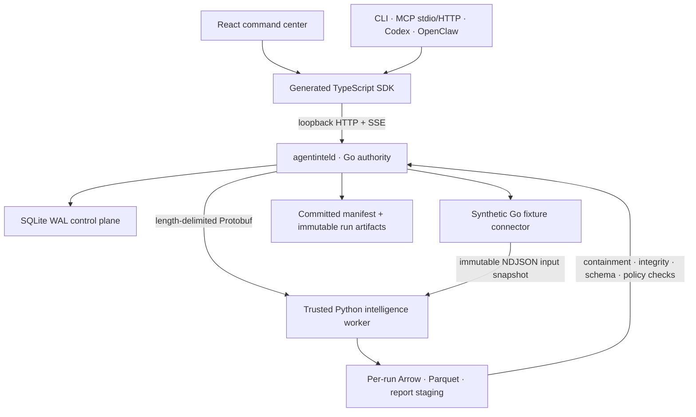

# Architecture

AGENTintel is organized around one authority process and language-neutral
contracts. The current repository is a walking skeleton, so this document
separates the implemented topology from the intended Competitive Pulse system.

## Implemented Phase 1 topology

The Go daemon alone changes durable run state and publishes evidence. A worker
proposes files from a per-run staging directory; those files are not queryable
until the daemon accepts them and writes the committed manifest. The public run
header records the immutable input hash/schema/size and, after successful
derivation, worker, model, connector and parser versions. The private input path
is deliberately not part of the HTTP contract.

For production evidence, Go opens both Arrow IPC and Parquet with independent
readers, requires the exact 32-field schema and metadata, validates row/time/
rights/data-class constraints, compares the decoded rows, and resolves every
report citation against canonical evidence. File signatures or worker-declared
row counts are never accepted as physical schema proof.

Phase 1 has a durable, single-daemon SQLite queue, transactional claiming,
cancellation and immutable-input replay. It does not yet implement the full
distributed lease, heartbeat, checkpoint and dead-letter protocol described in
the product plan. Filesystem publication uses an atomic same-filesystem rename;
SQLite result finalization is a separate transaction, so crash reconciliation
remains an explicit system boundary rather than a claimed cross-filesystem
transaction.

## Data planes

- **SQLite WAL:** runs, request snapshots, input provenance, events, artifact
  headers, entities and local search documents.
- **NDJSON:** the synthetic collector's immutable raw input snapshot.
- **Arrow IPC and Parquet:** canonical 32-field worker output and local
  analytical evidence.
- **DuckDB and Polars:** bounded in-process analysis inside the Python worker.
- **Committed manifests:** the only file allowlist for a completed run.

The fixture uses reserved `.invalid` URLs and proves normalization,
denominator-specific metrics, citations, contradiction preservation,
cancellation, corruption rejection and replay without live collection. A raw
content-addressed evidence store, compaction, retention/deletion propagation,
field encryption and FTS5/embedding rebuilds remain later work.

## Worker trust boundary

The signed desktop package treats its bundled Python runtime as trusted product
code. Rust verifies a private runtime snapshot and launches the exact
non-symlink interpreter. The Go protocol and artifact validators still apply as
defense in depth against bugs or compromised output.

Developer mode is different: `uv` launches Python as the same operating-system
user. `-I`, a minimal environment and a per-run working directory reduce
accidental coupling, but they do not prevent the process from reading same-user
files or opening network sockets. It is not an OS sandbox and must not run
untrusted third-party worker code. Sandboxed extensions require a future
OS/container/Wasm boundary.

## Contract sources and gates

1. `contracts/openapi/agentintel.openapi.yaml` owns the public HTTP surface.
2. `contracts/proto/agentintel/v1/worker.proto` owns worker control messages.
3. `contracts/json-schema` and `schemas/arrow` own evidence and connector files.

Go, Python and TypeScript bindings are generated. `pnpm contracts:lint`
regenerates every binding into a temporary directory, rejects byte drift and
validates representative Run, RunDetail, comparison-report and research-report
responses against the OpenAPI 3.1 schemas. Buf `FILE` compatibility rules are
configured, but a breaking-change comparison requires an explicit released
baseline; none is silently assumed for the initial workspace.

## Target topology after Phase 1

The planned system adds policy-governed Go collectors, a TypeScript browser
worker behind the Go egress proxy, a Parquet evidence lake queried only through
committed manifests, richer Python graph/model workers and a hosted MCP
surface. Website/RSS, YouTube, Reddit, AGENTseo and licensed-provider bridges
belong to Phase 2. Creator, company, workforce and hosted capabilities belong to
Phases 3–6. They are architecture targets, not current connector claims.

The Tauri webview receives no shell, filesystem, updater or credential command.
The Rust shell owns sidecar verification, keychain integration and updater
verification; a tested shell boundary is not the same as a signed public release.
