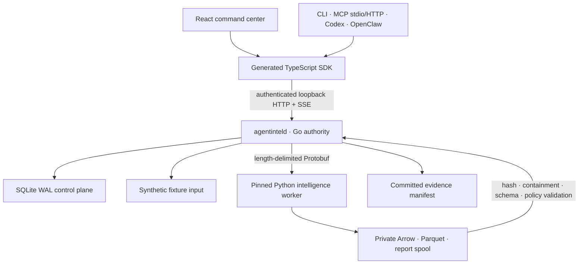

# AGENTintel — handoff текущей сессии

Дата фиксации: **2026-07-16**  
Рабочий каталог: `/Users/maxjafarov/Desktop/golem/agentintel-main`  
Связанный SEO-проект: `/Users/maxjafarov/Desktop/golem/agentseo-main`

Этот документ нужен для переноса разработки в новую Codex-сессию. Он описывает
не только замысел, но и фактическое состояние workspace, принятые границы,
результаты проверок и незавершенную работу. Источником истины по текущему scope
также остается [`status.md`](status.md).

## 1. Задача и долгосрочное видение

AGENTintel задуман как evidence-first центр бизнес-разведки для маркетинга,
продаж и разрешенных HR-сценариев: competitive intelligence, creator analytics,
company research, публичные профессиональные данные, тренды, метрики и
воспроизводимые исследовательские досье. Цель — конкурировать по качеству
аналитики и UX с Modash, Rival IQ, Analisa, Not Just Analytics и похожими
продуктами, сохраняя проверяемость каждого вывода.

Архитектура сознательно полиглотная:

- **Go** — authoritative daemon, API, orchestration, durable jobs, policy,
  collectors, storage commits и CLI;
- **Python** — Arrow/Polars normalization, DuckDB analytics, NLP, entity
  resolution, graph/model workloads и воспроизводимая оценка моделей;
- **TypeScript** — React command center, SDK, MCP, browser workers и agent/editor
  integrations;
- **Rust** — узкая Tauri 2 оболочка, проверка sidecar-компонентов, keychain и
  signed updater boundary;
- **OpenAPI 3.1, Protobuf, JSON Schema, Arrow, Parquet и SQL** — общие контракты
  между языками.

Финальная цель активной задачи — довести продукт до честного, проверенного и
готового к выпуску `1.0.0`. Простая замена номера версии не считается
завершением. На момент handoff проект остается **`0.2.0-alpha.0`**; Python-пакет
имеет внутреннюю версию `0.1.0`.

## 2. Зафиксированные продуктовые и правовые решения

- Community edition распространяется по **Elastic License 2.0** и является
  source-available, а не OSI open source. Hosted GolemWorkers edition отделяется.
- Первый глубокий vertical — social/creator competitive intelligence.
- People intelligence ограничен публичными профессиональными/company evidence
  и лицензированными рабочими контактами.
- Запрещены breach intelligence, stolen sessions, CAPTCHA bypass, private API
  evasion, covert account enumeration, biometric correlation, protected-trait
  inference, candidate ranking и автоматические employment decisions.
- LLM-ответ — derived claim, но никогда не source evidence.
- Отсутствующее значение нельзя превращать в ноль. Любая rate-метрика обязана
  содержать точный numerator, denominator, период и версию определения.
- Follower loss нельзя называть customer retention/churn.
- Человек не объединяется с другой записью только по имени; resolution должен
  быть обратимым и иметь review history.
- Любой reference archive остается недоверенным. Код из него нельзя исполнять,
  импортировать в build, индексировать как продуктовые данные или копировать до
  разрешения provenance/license/policy boundary.

Подробная граница описана в [`threat-model.md`](threat-model.md),
[`PRIVACY.md`](../PRIVACY.md) и
[`0001-reference-lab-clean-room-boundary.md`](adr/0001-reference-lab-clean-room-boundary.md).

## 3. Реально реализованный runtime

Сейчас существует hardened Phase 1 walking skeleton на полностью синтетическом
fixture с зарезервированными `.invalid` URL. Ни один live social platform этим
сценарием не вызывается.



### Go authority daemon

Реализованы:

- exact IPv4 loopback listener и строгая проверка `Host`;
- one-time dashboard bootstrap ticket во fragment, HttpOnly browser session,
  in-memory CSRF token и отдельный service token с режимом `0600`;
- REST API для compare/research, runs, ordered SSE events, cancel, replay,
  report, search, entity и monitoring;
- SQLite WAL queue, transactional claims, progress/events, cancellation и
  восстановление interrupted run в очередь;
- immutable content-addressed input snapshots и replay, который продолжает
  работать после удаления исходного fixture;
- private per-job workspace и worker supervision;
- прямой запуск sealed Python interpreter либо pinned `uv` developer runtime;
- authority-side физическое чтение Arrow IPC и Parquet, проверка точной
  32-field canonical schema, metadata, row/time bounds, data class, rights,
  retention, decoded row equivalence и report citations;
- derivation provenance: worker/model/connector/parser versions;
- canonical entities и search documents строятся из уже проверенных evidence,
  а не принимаются на доверии от worker;
- CLI без передачи service token через argv.

Основные файлы:

- [`cmd/agentinteld/main.go`](../cmd/agentinteld/main.go)
- [`internal/api/server.go`](../internal/api/server.go)
- [`internal/jobs/manager.go`](../internal/jobs/manager.go)
- [`internal/storage`](../internal/storage)
- [`internal/governance/canonical.go`](../internal/governance/canonical.go)
- [`internal/governance/artifacts.go`](../internal/governance/artifacts.go)

### Python intelligence worker

Реализованы:

- typed `compare` и `research` Protobuf workflows;
- bounded input/output paths и coherence validation запроса;
- PyArrow/Polars normalization и запись Arrow/Parquet;
- DuckDB analytical queries;
- denominator-specific engagement analytics;
- сохранение contradictory source observations при вычислении analytical value
  из numerator/denominator;
- отдельный deterministic research dossier с вопросом, source budget и планом;
- citations, limitations, contradictions и точный derivation block;
- Hypothesis/property, protocol, schema и failure tests.

Рабочий пакет: [`workers/intelligence`](../workers/intelligence). Модель и ее
ограничения описаны в [`MODEL_CARD.md`](../workers/intelligence/MODEL_CARD.md).

Важно: developer Python worker — trusted same-user process, а не OS/network
sandbox. `-I`, минимальное окружение и private workspace уменьшают accidental
coupling, но не защищают от намеренно вредоносного Python-кода. В desktop bundle
доверие строится на manifest-verified runtime snapshot.

### TypeScript surfaces

Реализованы:

- React/Vite command center с compare/research формой, live run timeline,
  metrics, citations, research plan и derivation provenance;
- восстановление browser session после refresh без сохранения токенов в
  `localStorage`/`sessionStorage`;
- generated SDK с exact-origin restriction, no redirects, защищенным чтением
  token file и SSE cursor/reconnect/dedup/cancellation;
- ровно шесть policy-safe MCP tools:
  `agentintel_research_start`, `agentintel_compare_start`,
  `agentintel_run_get`, `agentintel_search`, `agentintel_entity_get`,
  `agentintel_monitoring_status`;
- MCP stdio и authenticated loopback Streamable HTTP из одной server factory;
- Codex plugin bundle, Claude Code/Cursor/Antigravity manifests и OpenClaw
  adapter из общих schemas.

Ключевые каталоги:

- [`apps/dashboard`](../apps/dashboard)
- [`packages/sdk`](../packages/sdk)
- [`packages/mcp`](../packages/mcp)
- [`adapters/openclaw`](../adapters/openclaw)
- [`integrations`](../integrations)

При работе над TypeScript использовались локальные инструкции
`react-best-practices`; UI проверялся реальным браузером через Playwright.
Codex plugin создавался и проверялся по `plugin-creator` boundary.

### Rust/Tauri boundary

Реализованы:

- Tauri 2 lifecycle без shell/filesystem/updater/credential commands в webview;
- schema-v2 sidecar manifest с pinned interpreter и полным Python environment;
- no-follow copy в случайный private read-only snapshot;
- повторная hash verification перед spawn;
- bootstrap ticket передается только через bounded stdin и zeroized, не через
  argv/env;
- keychain/master-password fallback boundary;
- updater/signature verification primitives и filesystem permission tests.

Каталог: [`apps/desktop/src-tauri`](../apps/desktop/src-tauri).

### Контракты и reference laboratory

- HTTP source of truth: [`agentintel.openapi.yaml`](../contracts/openapi/agentintel.openapi.yaml)
- Worker source of truth: [`worker.proto`](../contracts/proto/agentintel/v1/worker.proto)
- JSON/Arrow schemas: [`contracts/json-schema`](../contracts/json-schema) и
  [`schemas/arrow`](../schemas/arrow)
- CI-style contract validator регенерирует bindings во временный каталог,
  byte-сравнивает их и валидирует реальные OpenAPI samples через Ajv.
- Buf breaking check fail-closed и требует явный released baseline.
- Все 50 локальных reference archives инвентаризированы и имеют
  `build_input: false` / `code_copy_allowed: false`.
- Strict secret heuristic на момент проверки нашел 35 путей; все они входят в
  path-only quarantine manifest, значения никогда не выводятся.

Phase 0 **не завершен**: для многих архивов отсутствуют точный upstream URL,
commit/tag, archive hash, acquisition chain и dependency provenance. Текущие
behavioral cards — triage, а не полный разбор каждой реализации. Возможные
Reddiment/Telegram Tracker credentials требуют внешнего подтверждения
rotation/revocation; код проекта этого не делал и не может доказать.

## 4. Что было сделано непосредственно перед переносом

1. Исправлен нестабильный Go-тест private workspace на macOS: test root теперь
   canonicalized через `filepath.EvalSymlinks`, поэтому `/var` и `/private/var`
   больше не дают ложный security failure.
2. Начато закрытие crash window между atomic filesystem publish и SQLite
   finalization:
   - добавлены `CompleteRecoveredRun`, `ListRecoveredRuns` и
     `MarkRecoveredFailed` в
     [`internal/storage/results.go`](../internal/storage/results.go);
   - `RecoverInterruptedRuns` теперь переводит run и recovery event в одной
     транзакции;
   - interrupted run с уже запрошенной отменой восстанавливается сразу как
     `cancelled`, а не повторно ставится в очередь.
3. Эти storage primitives отформатированы и проходят targeted tests, но
   **reconciliation еще не подключен к `jobs.Manager.Start`**. Это сознательно
   отмеченный незавершенный кусок, который новая сессия должна закончить первым.

Не следует считать crash recovery готовым только потому, что появились методы
storage. Нужен полный сценарий с повторным физическим чтением committed manifest.

## 5. Последние подтвержденные проверки

На 2026-07-16 получены следующие результаты:

| Gate                               | Результат                                                       |
| ---------------------------------- | --------------------------------------------------------------- |
| `pnpm contracts:lint`              | pass                                                            |
| `pnpm reference:validate`          | pass; 50 archives, 0 build inputs                               |
| `pnpm reference:scan:strict`       | pass; 35 finding paths, 0 unquarantined                         |
| Python `ruff check .`              | pass                                                            |
| Python `pytest -q`                 | **23 passed**                                                   |
| Rust `cargo test --locked`         | **17 passed**                                                   |
| Go full test до последнего patch   | единственный failure был macOS path-alias test, затем исправлен |
| Go targeted после последнего patch | `internal/storage` и `internal/jobs` pass                       |

После переноса обязательно заново прогнать **полный** Go/TypeScript/Rust suite,
race detector и реальный cross-process acceptance. Нельзя использовать таблицу
выше как доказательство готовности новых последующих изменений.

## 6. Критические блокеры до честного `1.0.0`

### P0 — целостность текущего ядра

- Закончить startup reconciliation для evidence, опубликованного до crash:
  физически вызвать `governance.LoadCommittedEvidence`, пересоздать projections,
  транзакционно завершить recovered run либо безопасно пометить повреждение.
- Добавить process-wide single-instance lock на data directory. Сейчас два
  daemon-процесса могут разделить один control plane.
- Добавить explicit lease owner, lease expiry, heartbeat, retry policy,
  checkpoints и dead-letter semantics; не путать HTTP SSE keepalive с job
  heartbeat.
- Автоматизировать cross-process Phase 1 acceptance: daemon, настоящий Python,
  compare, research, cancellation, replay, corruption/source failure, report,
  search/entity, MCP stdio/HTTP и OpenClaw.
- Проверить и протестировать startup cleanup orphan spool directories.
- Прогнать race/fuzz/adversarial security suites, включая malicious worker,
  prompt injection, SSRF/DNS rebinding/redirect и path traversal.

### P0 — release engineering

- Согласовать точную product contract для Community `1.0.0`; текущие документы
  честно называют Phases 2–6 roadmap, поэтому semver нельзя повышать заранее.
- Зафиксировать released Protobuf baseline и выполнить Buf compatibility check.
- Добавить reproducible release pipeline, SBOM, license audit, CodeQL,
  `govulncheck`, RustSec/npm/Python dependency audit, signed provenance и
  secret-canary scan артефактов/логов/backups.
- Собрать и проверить signed desktop installers и updater rollback channel.
- Подготовить backup/restore, retention/deletion/suppression и corruption
  recovery runbooks.

### P1 — продуктовая ценность Competitive Pulse

Сейчас enabled только synthetic fixture. Еще не реализованы production-ready:

- website/RSS/sitemap/schema.org collector;
- CSV/JSON/NDJSON/Parquet imports;
- AGENTseo bridge;
- YouTube Data и authorized Analytics;
- official Reddit API;
- authorized Meta professional-account и TikTok Display adapters;
- Google Trends official-access/import boundary;
- licensed provider adapters, например Modash;
- watchlists, schedules, alerts, cost/rate budgets и material-change engine;
- polished cited reports и reproducible multi-company demo dataset.

Каждый connector должен иметь policy manifest, allowed hosts, credential scope,
rate/cost budget, retention, kill switch, golden fixtures и failure tests. Нельзя
ускорять работу через undocumented private APIs, CAPTCHA bypass или anti-detection.

### P1/P2 — более широкая платформа

- creator discovery/campaign history/anomaly model cards;
- company registries, filings, funding, tech and hiring signals;
- governed licensed business contacts с masking, expiry и suppression;
- reversible entity resolution и review UI;
- graph/trend/anomaly/model workloads и calibration corpus;
- hosted GolemWorkers tenancy, RBAC, billing и distributed workers.

## 7. Рекомендуемая точная последовательность продолжения

### Шаг 1 — завершить crash reconciliation

1. В `jobs.Manager.Start`, **до запуска worker loops**, получить
   `store.ListRecoveredRuns`.
2. Для каждого run проверить наличие `runs/<run-id>/evidence` без следования по
   symlink.
3. Если evidence отсутствует, оставить run в очереди для idempotent retry.
4. Если evidence существует, вызвать `governance.LoadCommittedEvidence`; эта
   функция заново хеширует и физически декодирует artifacts.
5. Построить entities/search documents только из validated observations/report.
6. Вызвать `store.CompleteRecoveredRun`.
7. При invalid/corrupt committed evidence вызвать `MarkRecoveredFailed` с
   стабильным error code; не публиковать report через API.
8. Добавить tests для crash-after-rename, corrupted manifest, cancellation at
   restart, missing evidence retry и duplicate startup.

### Шаг 2 — single-instance и durable execution semantics

Добавить advisory file lock на data root с Unix/Windows реализациями и тестом
second-daemon rejection. Затем расширить SQLite schema полями lease owner,
expiry, heartbeat, attempts, next retry, checkpoint и dead-letter reason.
Clock/owner semantics должны тестироваться fake clock, а не sleeps.

### Шаг 3 — automated acceptance harness

Создать `scripts/phase1-acceptance.mjs`, который:

- собирает dashboard, Go daemon/CLI, SDK/MCP/OpenClaw;
- запускает daemon на `127.0.0.1:0` с временным data root;
- не печатает bootstrap/service tokens;
- выполняет реальный Python compare и research;
- проверяет Arrow + Parquet + report + manifest и provenance;
- проверяет SSE ordering/reconnect, cancel, replay после удаления mutable fixture,
  source failure и corrupt artifact;
- вызывает шесть MCP tools через stdio и authenticated Streamable HTTP;
- завершает child processes даже при failure.

### Шаг 4 — полный release gate

```bash
cd /Users/maxjafarov/Desktop/golem/agentintel-main

pnpm contracts:lint
pnpm reference:validate
pnpm reference:scan:strict
pnpm build
pnpm typecheck
pnpm lint
pnpm test

GOCACHE=/tmp/agentintel-go-cache go vet ./...
GOCACHE=/tmp/agentintel-go-cache go test -race -count=1 ./...
GOCACHE=/tmp/agentintel-go-cache go build ./cmd/...

cd workers/intelligence
.venv/bin/ruff check .
.venv/bin/pytest -q

cd ../..
PATH=/Users/maxjafarov/.rustup/toolchains/stable-aarch64-apple-darwin/bin:$PATH \
  cargo fmt --manifest-path apps/desktop/src-tauri/Cargo.toml -- --check
PATH=/Users/maxjafarov/.rustup/toolchains/stable-aarch64-apple-darwin/bin:$PATH \
  cargo check --locked --manifest-path apps/desktop/src-tauri/Cargo.toml
PATH=/Users/maxjafarov/.rustup/toolchains/stable-aarch64-apple-darwin/bin:$PATH \
  cargo test --locked --manifest-path apps/desktop/src-tauri/Cargo.toml
PATH=/Users/maxjafarov/.rustup/toolchains/stable-aarch64-apple-darwin/bin:$PATH \
  cargo clippy --locked --manifest-path apps/desktop/src-tauri/Cargo.toml -- -D warnings
```

Для real Python Go E2E используется opt-in переменная:

```bash
AGENTINTEL_REAL_WORKER_E2E=1 \
GOCACHE=/tmp/agentintel-go-cache \
go test -count=1 ./internal/api -run TestRealPythonWorkerThroughHTTPAndGoAuthority
```

### Шаг 5 — browser verification

После production build запустить новый daemon и через Playwright проверить:

- fragment token удаляется после bootstrap;
- browser storage остается пустым;
- compare и research завершаются и показывают разные workflow details;
- refresh восстанавливает session;
- report отображает research plan, citations и worker/model/connector/parser;
- cancellation/failure состояния доступны и понятны с клавиатуры;
- console/network не содержат ошибок и секретов.

Последний использованный рабочий Playwright CLI invocation:

```bash
NPM_CONFIG_CACHE=/tmp/golem-npm-cache \
npx --yes --package @playwright/cli playwright-cli -s=agentintel ...
```

## 8. Важные operational notes

- Требуемые версии сейчас заявлены как Go 1.26, Node 24, pnpm 10, Python
  3.12/3.13 с `uv`; Rust stable нужен для desktop.
- Локальная `.venv` в `workers/intelligence` уже использовалась для тестов.
- Не запускать код внутри `TO REVERSE ENGINEEER/`.
- Не выводить содержимое quarantined files и token files в terminal/tool output.
- Workspace находится внутри более крупного `/Users/maxjafarov/Desktop/golem`,
  где есть несвязанные пользовательские изменения. На момент handoff каталог
  `agentintel-main` отображался родительским Git как untracked (`?? ./` изнутри
  каталога). Нельзя делать массовый `git add`, reset или commit в родительском
  репозитории, пока не проверена intended repository boundary.
- Не удалять и не перезаписывать пользовательские изменения в соседних
  `golem-workers-ui-main`, `agentseo-main` и других каталогах.
- Внешний web research в этой сессии не выполнялся; все выводы основаны на
  локальном workspace и запущенных тестах.

## 9. Короткий prompt для новой сессии

```text
Продолжай разработку AGENTintel в
/Users/maxjafarov/Desktop/golem/agentintel-main.

Сначала полностью прочитай:
- docs/session-handoff-2026-07-16.md
- docs/status.md
- docs/architecture.md
- docs/threat-model.md

Не повышай версию косметически и не исполняй TO REVERSE ENGINEEER. Текущий
первый приоритет: закончить и протестировать crash reconciliation, начатый в
internal/storage/results.go и internal/storage/sqlite.go; подключить его до
worker loops в jobs.Manager.Start. После этого добавь single-instance lock,
автоматизированный real cross-process acceptance и прогони все polyglot gates.
Сохраняй ELv2, privacy/policy boundary и evidence-first provenance. Цель задачи
остается честный release-ready 1.0.0, а не просто Phase 1 demo.
```

## 10. Критерий завершения handoff

Новая сессия должна считать этот документ навигацией, но проверять каждый факт
по текущим файлам и новым command outputs. Если код и документ расходятся,
authoritative source — фактический workspace и воспроизводимая проверка. Goal
можно закрыть только после requirement-by-requirement release audit, когда ни
один заявленный gate или обязательный deliverable не остается без прямого
доказательства.
